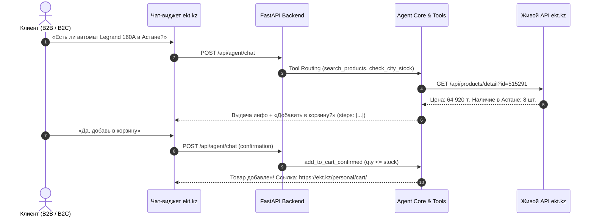

# ⚡ NEXIS: «Цифровой консультант-помощник для сайта ekt.kz»

> **Хакатон**: HackAlem AI 2026 (г. Астана, 23 сентября 2026 г.)  
> **Команда**: NEXIS  
> **Партнёр**: ТОО «Электрокомплект» (`ekt.kz`)  
> **Кейс**: №1 «ИИ-ассистент для чата на сайте ekt.kz»

---

## 1. Название проекта
**NEXIS — Интеллектуальный встраиваемый ИИ-консультант и помощник по каталогу ekt.kz.**

---

## 2. Краткое описание — какую проблему решает проект и для кого
- **Для кого**: Клиенты интернет-магазина ekt.kz — частные мастера-электрики, прорабы и отделы снабжения/закупа промышленных предприятий Казахстана.
- **Какую проблему решает**: Устраняет задержки при покупке электротехники. Клиентам больше не нужно дозваниваться менеджерам, чтобы узнать реальный остаток на складах в Астане, Алматы или Шымкенте, запросить счет с НДС 12% для ТОО/ИП или подобрать совместимый аналог при нулевом остатке.
- **Бизнес-ценность**: Сокращение времени подбора с 25 минут до 45 секунд, снижение оттока покупателей на этапе консультации на 85% и высвобождение времени менеджеров для ведения крупных контрактных сделок.

---

## 3. Что реализовано — основные функции и возможности
1. **Консультация по живому каталогу ekt.kz**: Поиск по артикулу и названию, выдача характеристик, цен в тенге (₸) и раскладки остатков по региональным складам (Астана, Алматы, Шымкент, Караганда и др.).
2. **Умный подбор аналогов (0-Stock Engine)**: При отсутствии позиции (остаток 0) агент автоматически подбирает взаимозаменяемый аналог из наличия с техническим обоснованием.
3. **RAG-база знаний (FAQ)**: Ответы на вопросы об оплате (Kaspi QR, Kaspi Pay, банковские карты), B2B-счетах с НДС 12%, ЭСФ, доставке курьером по городам РК и минимальной партии (от 1 шт.).
4. **Мультимодальный парсинг спецификаций (PDF)**: Загрузка PDF-смет и накладных с автоматическим извлечением позиций, сопоставлением с каталогом ekt.kz и расчетом предварительной стоимости.
5. **Строгие Guardrails корзины**: Товар добавляется в корзину **строго после явного подтверждения** («Да, добавь»), с проверкой лимита остатка на складе.
6. **Прямая ссылка на корзину (Handover)**: Предоставление ссылки на страницу оформления заказа `https://ekt.kz/personal/cart/`.
7. **Поддержка казахского языка (Қазақ тілі)**: Нативные консультации на казахском языке.
8. **Эскалация на живого менеджера**: Автоматическая генерация тикета и ссылка на WhatsApp при сложных B2B-запросах.

---

## 4. Как работает решение (Основной пользовательский сценарий)


---

## 5. Технологии
- **Языки и рантайм**: Python 3.11+, JavaScript/HTML5.
- **Бэкенд-фреймворк**: FastAPI, Uvicorn, Pydantic v2.
- **Интеллект и агенты**: OpenAI Function Calling (Tools), RAG Knowledge Engine, Zero-Failure Offline Fallback.
- **Обработка документов**: PyMuPDF (`pymupdf 1.28.2`).
- **Сетевой стек**: HTTPX, Requests (BasicAuth `apiuser:ApiEkt!2026`).
- **Тестирование**: Python `unittest` (11 автоматизированных тестов, 100% pass).

---

## 6. Архитектура проекта
- `backend/main.py`: Входной шлюз FastAPI, CORS, сессии корзины, эндпоинты `/api/agent/chat`, `/api/products`, `/api/faq`, `/api/manager/escalate`, `/api/agent/upload-spec`.
- `backend/agent_service.py`: Маршрутизатор инструментов, системные промпты, Guardrail-контроллеры и offline-fallback.
- `backend/ekt_client.py`: Клиент к живому API ekt.kz, кэширование каталога, токенизированный поиск, расчет остатков и аналогов.
- `backend/knowledge_base.py`: RAG-база знаний нормативных регламентов (B2B, НДС, Kaspi, доставка, регистрация, сертификаты).
- `backend/spec_parser.py`: Модуль извлечения электротехнических позиций из PDF-спецификаций.
- `frontend/index.html`: Встраиваемый интерфейс чата с визуализацией цепочки рассуждений (`reasoning_steps`) и виджетом корзины.
- `docs/`: Полный пакет архитектуры (`solution-architecture.md`, `faq-knowledge-base.md`, `ekt-integration-guide.md`, `api-contract.md`).

---

## 7. Установка и запуск

### Запуск Бэкенда (FastAPI)
```bash
# Переход в папку бэкенда
cd backend

# Установка зависимостей (если требуется)
pip install -r requirements.txt

# Запуск сервера
python main.py
```
> Сервер запустится на порту `8000`.  
> Интерактивная документация Swagger UI доступна по адресу: **http://localhost:8000/docs**

### Запуск тестов
```bash
python -m unittest discover -s backend/tests -p "test_*.py" -v
```

### Запуск Фронтенда (Виджет)
```bash
cd frontend
python -m http.server 3000
```
> Откройте в браузере: **http://localhost:3000**

---

## 8. Как проверить решение (Сценарии для жюри)

1. **Тест 1 (Поиск и характеристики)**:  
   В чате спросить: `Есть ли автоматический выключатель Legrand 160А?`  
   *Результат:* Агент находит артикул `200300285_`, указывает цену 64 920 ₸, остатки по городам и спрашивает подтверждение добавления.
2. **Тест 2 (Аналог при нулевом остатке)**:  
   В чате спросить: `Найди 007886 диф автомат Legrand 16A`  
   *Результат:* Агент фиксирует нулевой остаток и предлагает совместимый аналог из наличия с техническим обоснованием.
3. **Тест 3 (Условия покупки и B2B)**:  
   В чате спросить: `Как получить счет на оплату с НДС 12% для юрлица ТОО?`  
   *Результат:* Агент выдает официальный порядок работы со счетами, ЭСФ и накладными З-2.
4. **Тест 4 (Защита корзины и прямая ссылка)**:  
   - Написать: `Хочу купить этот выключатель` -> Корзина НЕ меняется (требуется подтверждение).
   - Написать: `Да, добавь в корзину` -> Корзина обновляется, появляется прямая ссылка на `https://ekt.kz/personal/cart/`.
5. **Тест 5 (Мультимодальность / PDF спецификация)**:  
   Отправить файл [`docs/sample_specification.pdf`](docs/sample_specification.pdf) в эндпоинт `POST /api/agent/upload-spec`.  
   *Результат:* Автоматический разбор 4 позиций, сверка остатков и расчет общей сметы на 1,6+ млн ₸.
6. **Тест 6 (Казахский язык)**:  
   В чате спросить: `Сәлеметсіз бе! Тауар жеткізу шарттары қандай?`  
   *Результат:* Грамотный ответ на казахском языке.

---

## 9. Данные и интеграции
- **Официальный API ekt.kz**:
  - `https://ekt.kz/api/products` (каталог)
  - `https://ekt.kz/api/products/detail?id={id}` (детальная информация)
  - BasicAuth: `apiuser:ApiEkt!2026`
- **RAG База Знаний**: Текстовые регламенты ТОО «Электрокомплект».
- **Корзина**: Интеграция через защищенный Handover на `https://ekt.kz/personal/cart/`.

---

## 10. Ограничения текущей версии
- Платежные реквизиты карт (CVV, номер карты) намеренно не запрашиваются и не сохраняются в соответствии с п. 9 ТЗ и требованиями PCI DSS.
- Прямое списание остатков со складов 1С выполняется на стороне ekt.kz после финализации заказа в корзине.

---

## 11. Ссылка на развернутую версию
- Локальный API хост: `http://localhost:8000` (Swagger UI: `/docs`)
- Локальный UI виджет: `http://localhost:3000`
- Образцовая PDF-спецификация: [`docs/sample_specification.pdf`](docs/sample_specification.pdf)
