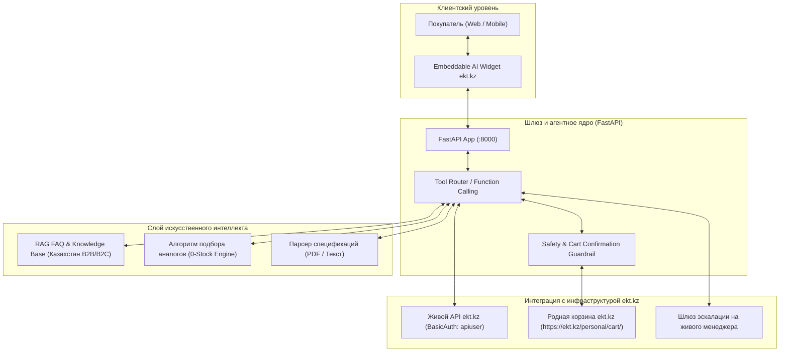

# 🏛️ Архитектура решения: «Цифровой консультант ekt.kz» (NEXIS Embedded AI)

> **Кейс**: #1 ИИ-ассистент-консультант для сайта ekt.kz (ТОО «Электрокомплект»)  
> **Команда**: NEXIS  
> **Событие**: HackAlem AI 2026 (Астана, EXPO)

---

## 1. Проблема бизнеса и ценность решения

Сейчас клиенты интернет-магазина ekt.kz (электромонтажники, частные мастера и отделы закупа промышленных предприятий) сталкиваются со следующими проблемами:
- Для уточнения наличия на региональных складах (Астана, Алматы, Шымкент, Караганда и др.) необходимо звонить или писать менеджеру в WhatsApp.
- При отсутствии товара (остаток 0) покупатели уходят к конкурентам, так как на сайте нет автоматического подбора взаимозаменяемых электротехнических аналогов с техническим обоснованием.
- Корпоративные клиенты тратят время на выяснение стандартных условий: выставление счетов на оплату с НДС 12%, подписание ЭСФ, получение сертификатов ТР ТС и регистрация компании по БИН.
- Менеджеры перегружены однотипными консультациями вместо закрытия крупных сделок.

### Бизнес-эффект:
- **Сокращение времени подбора и заказа**: с 25 минут звонков до 45 секунд в чате.
- **Снижение оттока клиентов**: удержание до 85% покупателей за счет моментального предложения аналогов при нулевых остатках.
- **Разгрузка отдела продаж**: до 70% типовых обращений закрываются ИИ-ассистентом автономно.

---

## 2. Архитектурная диаграмма решения

---

## 3. Ключевые компоненты системы

### А. Встраиваемый виджет (Plug-and-Play)
Решение проектируется не как отдельный изолированный сайт, а как встраиваемый модуль для сайта `ekt.kz`. Он может работать:
1. В виде плавающего виджета в правом нижнем углу сайта ekt.kz.
2. В виде встроенного модального окна или полноэкранной вкладки мобильного приложения.

### Б. Живой API клиент ekt.kz (`backend/ekt_client.py`)
- Прямое подключение к REST API партнера:
  - `https://ekt.kz/api/products?page={n}`
  - `https://ekt.kz/api/products/detail?id={id}`
- Кэширование каталога в памяти для ответа за миллисекунды.
- Парсинг региональных складов (Астана, Алматы, Шымкент, Караганда и др.).

### В. RAG-база знаний (`backend/knowledge_base.py`)
База нормативно-справочной информации, регламентов и условий обслуживания ТОО «Электрокомплект»:
- Правила работы с B2B: счета на оплату, НДС 12%, ЭСФ, договоры поставки.
- Правила работы с B2C: Kaspi QR, Kaspi Pay, оплата картой, самовывоз.
- Доставка по Казахстану: сроки, тарифы курьеров и транспортных компаний.
- Регистрация и личный кабинет (физлица / юрлица по БИН).
- Сертификация ТР ТС, паспорта изделий, ГОСТ, гарантии.

### Г. Железные Guardrails (Безопасность)
1. **Защита корзины**: Любые изменения корзины производятся ТОЛЬКО после явного подтверждения клиента ("Да, добавь", "добавляй", "иә, себетке сал").
2. **Лимит остатка**: Количество товара в корзине не может превышать фактический остаток на складах ekt.kz.
3. **Обязательные аналоги**: Если остаток товара 0, агент обязан найти минимум один доступный аналог с техническим обоснованием.
4. **Конфиденциальность**: Агент никогда не запрашивает и не хранит платежные данные (CVV, реквизиты карт).

---

## 4. Сценарий работы (End-to-End User Journey)
1. **Вход**: Клиент заходит на ekt.kz и открывает окно ИИ-консультанта.
2. **Запрос**: Клиент пишет: *«Нужен автомат Legrand на 160А в Астане»* (или прикрепляет фото/спецификацию).
3. **Анализ**: Агент запускает `search_products` и `check_city_stock` через API ekt.kz.
4. **Ответ**: Агент сообщает цену (64 920 ₸), остаток в Астане (8 шт.), параметры и спрашивает: *«Добавить в корзину (1 шт.)?»*.
5. **Подтверждение**: Клиент отвечает: *«Да, добавь»*.
6. **Handover**: Агент вызывает `add_to_cart_confirmed`, обновляет счетчик корзины и предоставляет прямую ссылку на корзину ekt.kz для оформления заказа.
